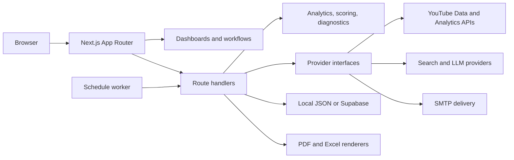

# Parallax — YouTube Intelligence Hub

Parallax is a full-stack, multi-brand YouTube intelligence platform for analytics, content optimization, AI-search visibility, reporting, and channel operations. It turns channel data into prioritized actions while keeping demo, public, and authenticated data clearly separated.

> **Portfolio summary:** Built an end-to-end YouTube intelligence product with OAuth-secured API integrations, cross-channel analytics, Shorts and Posts optimization, AI visibility tracking, automated client reporting, scheduling, and 31 automated unit tests.

## Product highlights

| Capability               | What it enables                                                                                                     |
| ------------------------ | ------------------------------------------------------------------------------------------------------------------- |
| Multi-brand workspace    | Manage separate brands and YouTube channels from one portfolio view.                                                |
| Channel intelligence     | Explore trends, traffic sources, search queries, audience signals, and performance drivers.                         |
| Video diagnostics        | Search a video library and turn rule-based evidence into specific optimization actions.                             |
| Shorts and Posts lab     | Improve hooks, retention structure, packaging, posting cadence, and community content.                              |
| AI Visibility            | Discover keywords, check owned-video citations across search and LLM surfaces, and create LLM-ready content briefs. |
| Competitor intelligence  | Compare public channel signals without implying access to private competitor analytics.                             |
| Client reporting         | Build branded PDF and Excel reports, select custom date ranges, schedule delivery, and send to multiple recipients. |
| YouTube operations       | Connect with OAuth and work with videos, playlists, comments, analytics, and live-stream resources.                 |
| Alerts and opportunities | Score strategic opportunities and surface performance issues that need attention.                                   |

## Engineering highlights

- Next.js App Router application with React, strict TypeScript, Tailwind CSS, and Recharts.
- Server-side Google OAuth authorization-code flow with HTTP-only state cookies, AES-256-GCM token encryption, and automatic access-token refresh.
- Replaceable provider boundaries for YouTube, trends, LLM/search, and email services.
- Deterministic scoring and diagnostics that remain useful when generative AI providers are unavailable.
- Shared report-selection model powering both Excel and PDF renderers.
- Persistent local development state plus a normalized Supabase/PostgreSQL deployment schema.
- Zod validation at mutable API boundaries and signed, HTTP-only application sessions.
- Vitest coverage for analytics, AI visibility, reporting, scheduling, scoring, cryptography, sessions, and Shorts logic.

## Architecture



See [docs/ARCHITECTURE.md](docs/ARCHITECTURE.md) for the component map, data flows, security boundaries, and production-readiness path.

## Run locally

### Requirements

- Node.js 20.9 or newer; Node.js 24 LTS is supported.
- npm, included with Node.js.

### Fastest Windows setup

1. Clone or download the repository.
2. Double-click `Start-Parallax.cmd`.
3. Keep the terminal window open while using the app.
4. Open [http://localhost:3000](http://localhost:3000) if the browser does not open automatically.
5. Sign in with any valid email and a password of at least eight characters in local development.
6. Select **Set up workspace → Load 5 demo brands** for a credential-free walkthrough, or add a brand manually.

The launcher checks Node/npm, completes first-run setup, starts the app and report worker, and opens the browser. Press `Ctrl+C` to stop it.

### Manual setup

```powershell
npm install
Copy-Item .env.example .env.local
npm run dev
```

In a second terminal, start the report scheduler:

```powershell
npm run worker
```

Scheduled jobs run only while both the application and worker are active.

## Demo path

A short recruiter walkthrough can be completed without external credentials:

1. Load the five synthetic demo brands during onboarding.
2. Review the cross-brand portfolio overview and change the comparison period.
3. Open a channel to inspect trends, traffic sources, and performance drivers.
4. Use **Videos** and **Shorts & Posts** to review optimization recommendations.
5. Open **AI Visibility** to generate keyword and content opportunities from owned metadata.
6. Build a report with a custom date range, choose sections, add recipients, and export PDF or Excel.
7. Create an alert rule and review the scored strategy opportunities.

Demo data is synthetic and labeled. Live provider results are never silently replaced with simulated claims.

## Quality checks

```powershell
npm run typecheck
npm run lint
npm test
npm run build
```

The repository also includes a Playwright critical-path journey:

```powershell
npx playwright install chromium
npm run test:e2e
```

## Optional integrations

The local demo works without credentials. Copy `.env.example` to `.env.local` and configure only the providers you want to test.

| Integration               | Configuration                                                                             |
| ------------------------- | ----------------------------------------------------------------------------------------- |
| YouTube OAuth             | `GOOGLE_CLIENT_ID`, `GOOGLE_CLIENT_SECRET`, `GOOGLE_REDIRECT_URI`, `TOKEN_ENCRYPTION_KEY` |
| Google AI Overview checks | `SERPAPI_API_KEY`                                                                         |
| OpenAI visibility checks  | `OPENAI_API_KEY`, optional `OPENAI_MODEL`                                                 |
| Gemini grounded checks    | `GEMINI_API_KEY`, optional `GEMINI_MODEL`                                                 |
| SMTP delivery             | `MAIL_PROVIDER=smtp`, `SMTP_HOST`, `SMTP_PORT`, `SMTP_USER`, `SMTP_PASSWORD`, `SMTP_FROM` |
| Production login          | `PARALLAX_LOGIN_EMAIL`, `PARALLAX_LOGIN_PASSWORD`, `PARALLAX_SESSION_SECRET`              |

### YouTube API setup

1. Create or select a Google Cloud project.
2. Enable `youtube.googleapis.com` and `youtubeanalytics.googleapis.com`. If Google Cloud CLI is installed, run `./Enable-YouTubeApis.ps1 -ProjectId "your-project-id"`.
3. Configure the Google Auth Platform consent screen and add test users while the app is in testing.
4. Create a **Web application** OAuth client.
5. Add `http://localhost:3000/api/auth/youtube/callback` as an authorized redirect URI.
6. Add the OAuth values and a strong encryption key to `.env.local`, then restart Parallax.
7. Open **Data & Integrations**, connect YouTube, and use **Test APIs** in the YouTube operations console.

The operations console supports content search, playlist management, video and comment statistics, channel branding settings, resumable uploads, analytics, and live broadcast/stream workflows. Write operations only run after an explicit user action.

### Optional Supabase environment

The demo UI does not require Supabase. To exercise PostgreSQL, authentication, and storage locally, install Docker Desktop and the Supabase CLI, then run:

```powershell
supabase start
supabase db reset
```

The migration under `supabase/migrations/` creates brand-scoped analytics, diagnostics, opportunities, alerts, reporting, scheduling, delivery, and integration tables. The seed creates the same five demo brands and channels.

## Security and data integrity

- OAuth tokens stay server-side, are encrypted at rest, and never reach client JavaScript.
- Sessions are signed, stored in HTTP-only cookies, and expire after 12 hours or 30 days when **Keep me signed in** is selected.
- Production login fails closed until explicit credentials and a session secret are configured.
- Competitor views use public fields only; Parallax does not imply access to private competitor analytics.
- Unsupported or suppressed metrics are shown as unavailable instead of being estimated.
- AI/search results are timestamped samples and provider responses remain distinguishable.
- Secrets, runtime state, generated reports, and build output are excluded from version control.

## Useful commands

| Command             | Purpose                                |
| ------------------- | -------------------------------------- |
| `npm run dev`       | Start the development server.          |
| `npm run worker`    | Run scheduled-report jobs.             |
| `npm run typecheck` | Check strict TypeScript.               |
| `npm run lint`      | Run ESLint with zero warnings allowed. |
| `npm test`          | Run Vitest unit tests.                 |
| `npm run test:e2e`  | Run the Playwright critical path.      |
| `npm run build`     | Create a production build.             |
| `npm start`         | Serve the production build.            |

## Project status

Parallax is a portfolio-ready local MVP with functional dashboards, reporting, scheduling, alerts, optimization tools, provider adapters, and live YouTube integration paths. Production deployment would add managed secret storage, durable job infrastructure, organization-level authorization, centralized observability, and provider-specific quota controls.

See [BUILD_STATUS.md](BUILD_STATUS.md) for the implementation inventory and next-stage work.

## License

No open-source license has been granted. The source is available in this repository for portfolio review.
