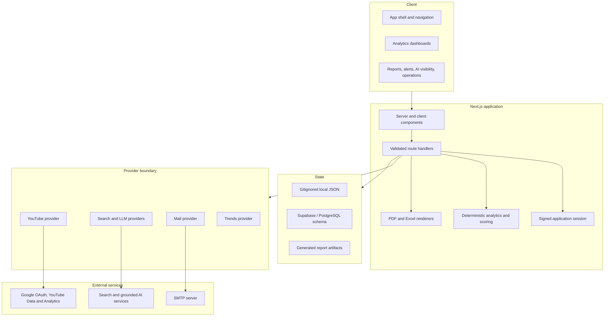
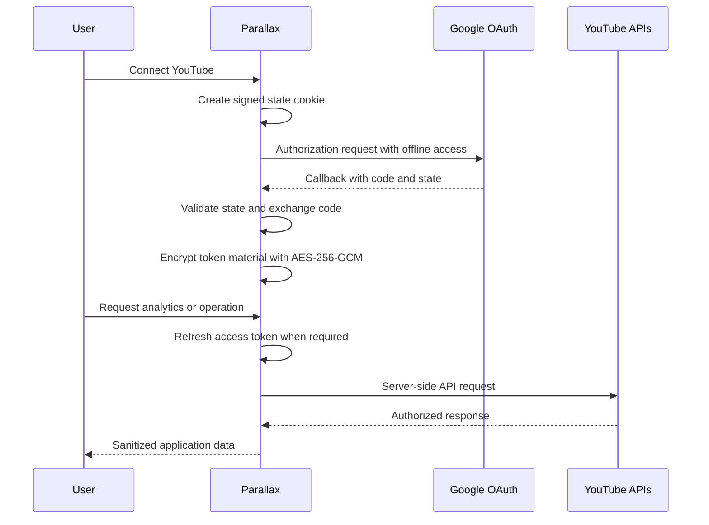
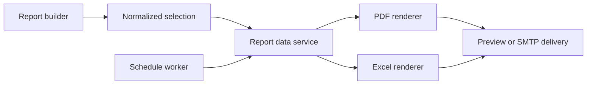

# Parallax Architecture

This document describes the main runtime boundaries behind Parallax — YouTube Intelligence Hub and the decisions that make the local MVP safe to demonstrate and straightforward to evolve.

## System map



## Application layers

### Experience layer

The App Router pages under `src/app/` organize the product by user workflow: onboarding, portfolio overview, channels, videos, Shorts and Posts, competitors, opportunities, AI visibility, alerts, reporting, integrations, and settings. Shared shell, chart, and form components live under `src/components/`.

### Route and validation layer

Route handlers under `src/app/api/` are the server boundary for mutable application behavior. Requests are validated before reaching persistence or provider code. Sensitive credentials and OAuth tokens remain on the server.

### Domain layer

Pure modules under `src/lib/` handle analytics, scoring, Shorts recommendations, report selection, schedule calculation, visibility analysis, and session logic. Keeping these calculations separate from page components makes them testable and avoids making core recommendations dependent on an LLM.

### Provider layer

Provider interfaces isolate external services:

- YouTube handles OAuth-authenticated Data, Analytics, and live-streaming operations.
- AI visibility providers handle YouTube Search, Google AI Overview, OpenAI web search, and Gemini grounded search.
- Mail supports a safe local preview mode and an SMTP adapter.
- Trends and LLM interfaces allow future provider substitution without changing product workflows.

Each provider reports its own status. A missing credential is surfaced as unavailable rather than replaced by fabricated live data.

### Persistence layer

Local development uses gitignored JSON state so the application runs without infrastructure. The Supabase migration provides a normalized, brand-scoped PostgreSQL model for deployment. Generated PDF and Excel files are also excluded from version control.

## Key data flows

### YouTube OAuth



OAuth state is stored in an HTTP-only cookie. Refresh and access tokens never reach browser JavaScript. Production deployment should place encrypted credentials in managed secret storage and add organization-level access controls and audit policy.

### Reporting and scheduling

The report builder produces one normalized selection containing the brand, date range, comparison, metrics, sections, recipients, and commentary. Both renderers consume that selection, keeping PDF and Excel output aligned. The worker evaluates persisted schedules and calls the same report/delivery boundary used by an interactive send.



### AI visibility

Keyword discovery combines seed topics and owned-video metadata. Live checks are recorded per provider with timestamps and source-specific status. Suggestion logic uses those observations to create keyword and content opportunities without treating a single response as a universal ranking result.

## Trust boundaries

- Demo data is synthetic and labeled throughout the product.
- Public competitor data is kept separate from authenticated owned-channel analytics.
- Missing, suppressed, or unsupported metrics are represented explicitly.
- Write operations against YouTube require an intentional UI action.
- Local preview email delivery does not contact recipients.
- `.env*`, OAuth material, runtime JSON, generated reports, logs, and build artifacts are gitignored.

## Test strategy

Vitest unit suites exercise deterministic business logic and security-sensitive helpers. Playwright covers the critical product journey in a browser. The standard quality gate is:

```powershell
npm run typecheck
npm run lint
npm test
npm run build
```

## Production-readiness path

The current design intentionally keeps the local demo simple. A production deployment should add:

1. Managed PostgreSQL and encrypted secret storage.
2. Organization, role, and brand-level authorization.
3. A durable queue and independently deployed report worker.
4. Centralized logging, tracing, alerting, and delivery observability.
5. Provider quotas, retries, backoff, and idempotency guarantees.
6. Security review, dependency scanning, backup policy, and token-rotation procedures.
7. A deployment pipeline that runs the complete quality gate before promotion.
